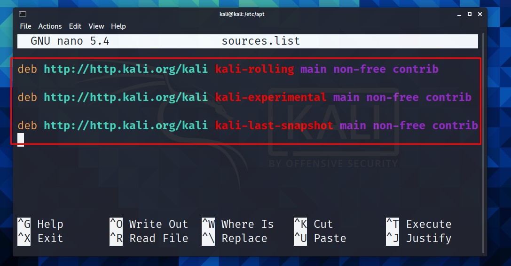

# sources.list-
sources.list  for kali linux 2021.1

``
cd etc/apt/
``

 ``
sudo nano sources.list 
 ``
 
 
 
 # copy this and paste in sources.list and click ctrl x  and y enter enter
 

deb http://http.kali.org/kali kali-rolling main non-free contrib

deb http://http.kali.org/kali kali-experimental main non-free contrib

deb http://http.kali.org/kali kali-last-snapshot main non-free contrib

# and now just run this 

``
sudo apt -y full-upgrade
``

``
sudo apt update && sudo apt -y full-upgrade && sudo reboot
``
